## 🤖 Classical-computer-vision
Note:  This project is a culmination of my work for the **"EECS 504: Foundations of Computer Vision"** course, conducted from September to December 2023. The course provided a solid foundation in classical computer vision algorithms/techniques for feature extraction, feature matching, image transformation, color image reconstruction, image denoising, image classification, and image segmentation.

  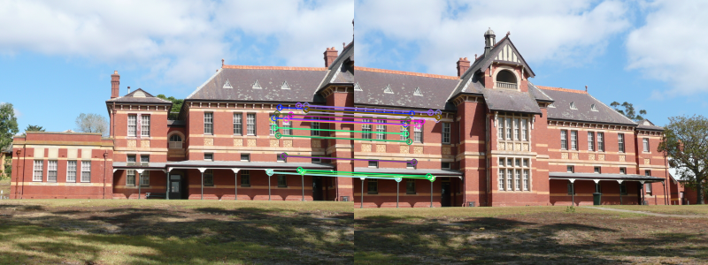
  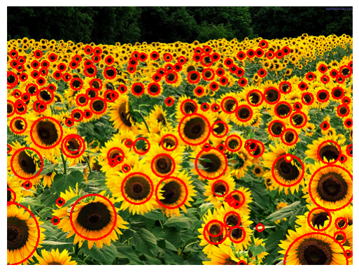
  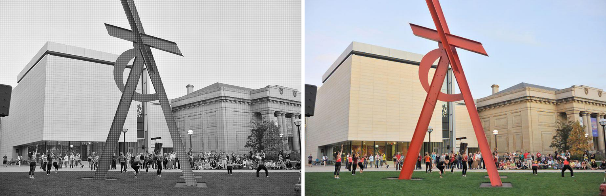
  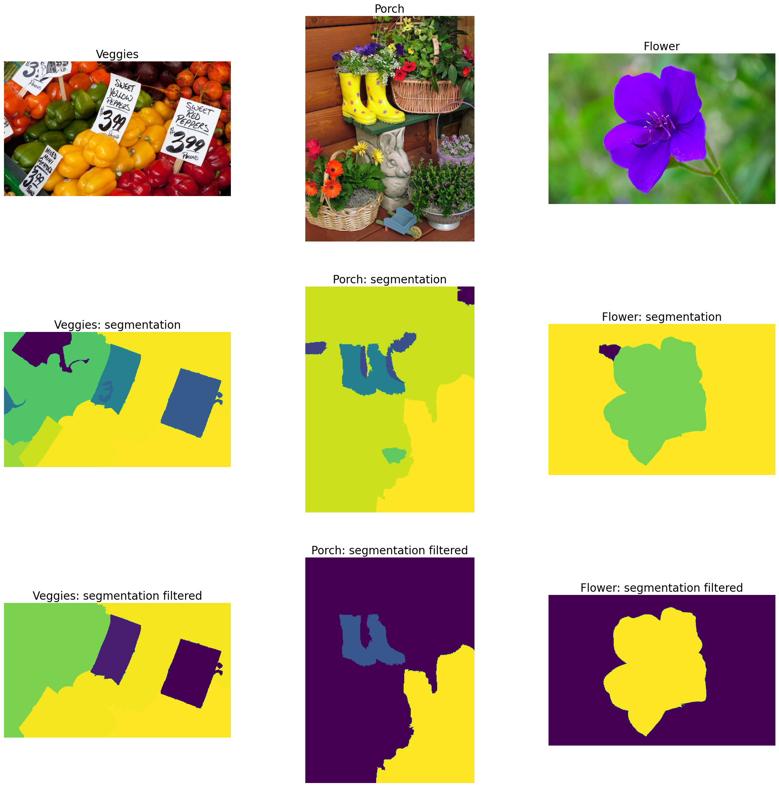

### 🎯 Goal
The goal of this project is to provide a useful resource for anyone seeking to understand and implement classical computer vision techniques. For a brief overview, this repo contains the following implementations:
- Harris corner detector
- ORB-feature detector
- Homography estimation
- Image transformation
- Color Image reconstruction
- Image denoising
- Image segmentation

## 🛠️ Test/Demo
- Feature extraction and matching
    - Launch the jupyter notebook inside the directory 'Feature extraction and matching'. The notebook contains implementations of Harris corner detector, ORB-feature detector, and later on image stitching and blob detection.
- Homography and Image Demosaicking
    - Launch the jupyter notebook inside the directory 'Homography and Image Demosaicking'. The notebook contains implementations of Homography estimation for drawing lines on NFL pitch, and later on simulating the RGB color image reconstruction using Bayer Demosaicking.
- Image Denoising and segmentation
    - Launch the jupyter notebook inside the directory 'Image Denoising and segmentation'. The notebook contains implementations of Mumford-Shah model for image denoising, foreground-background segmentation using graph-cut algorithm, and multi-group segmentation using minimum spanning forest algorithm.

## 📊 Results
### 📈 Feature extraction and matching
- Harris corner detector

      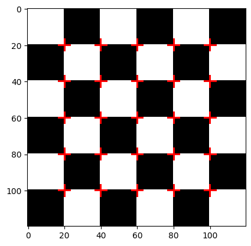

      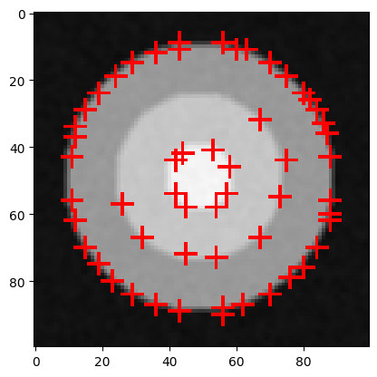

- Image stitching using ORB features

      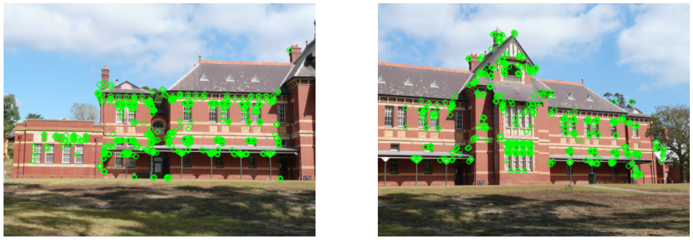

      

      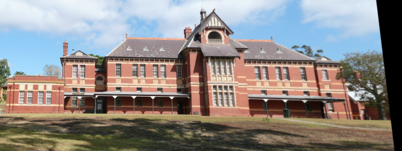

- Blob detection

      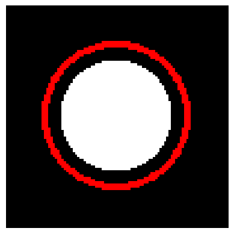

      

### 📈 Homography and Image Demosaicking
- NFL Pitch homography (drawing line upon estimating the homography)

      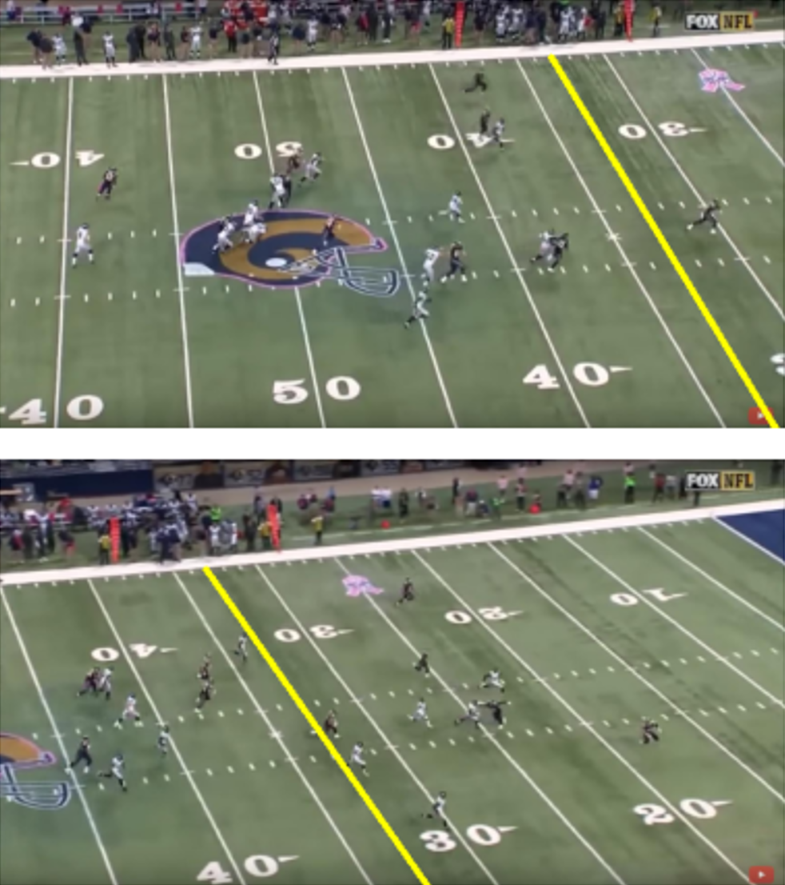

- Color Image reconstruction (using Bayer demosaicking)

      

### 📈 Image Denoising and segmentation
- Image denoising (left: original image; Right: denoised image)

  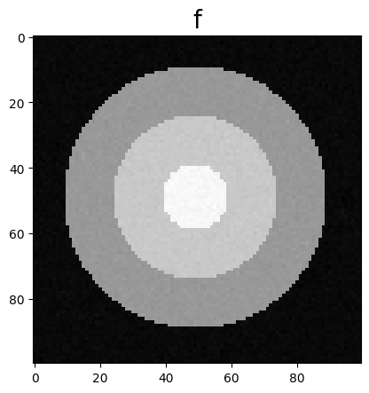
  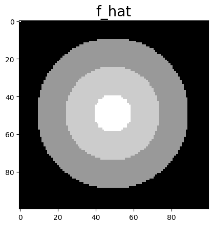

- Foreground-background segmentation (using graph_cut algorithm)

      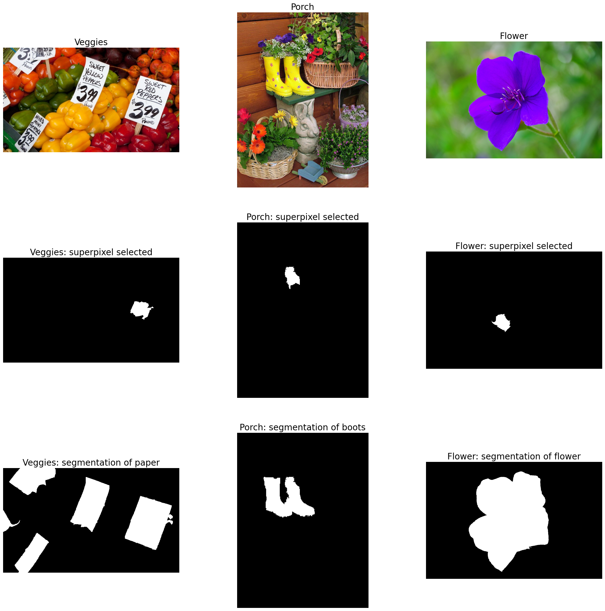

- Superpixel maps

      

- Multi-group segmentation (minimum spanning forest algorithm)

      

